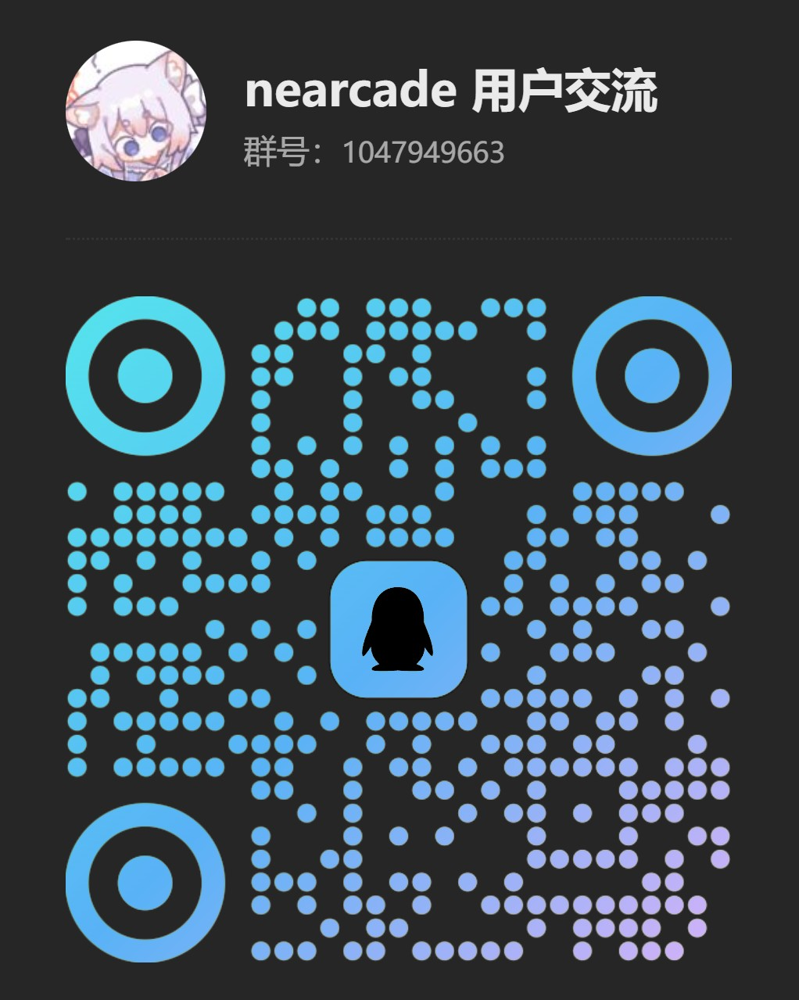

# nearcade 🕹️

**中文** | [English](README_en.md)

一个帮你快速查找任意位置附近的机厅的网站。

有关网站的问题答疑、数据纠正、功能建议等请加入以下 QQ 群进行讨论。



## ✨ 功能特色

### 🎯 附近探索

- **我的位置**：基于当前位置查找附近的机厅
- **高校搜索**：搜索特定高校校园附近的机厅
- **地图选址**：在交互式地图上选择任意位置
- **自定义半径**：在 1~30 km 半径内搜索

### 🏆 高校排行榜

- 根据校园周围的机厅/机台覆盖情况对高校进行排名
- 指标包括店铺数量、总机台数和区域密度（每平方公里机台数）
- 特定游戏机台数量的专项排名
- 每日数据更新，24 小时缓存刷新

### 🎮 支持的游戏

- 舞萌DX
- 中二节奏
- 太鼓之达人
- 音律炫动
- 华卡音舞

## 🛠️ 技术栈

### 前端框架

- **SvelteKit**：具有 SSR/SPA 功能的全栈框架
- **Svelte 5**：具有增强响应式系统的最新版本
- **TypeScript**：提供全程类型安全的开发体验

### 样式和 UI

- **Tailwind CSS 4.0**：实用程序优先的 CSS 框架
- **daisyUI**：Tailwind 的语义化组件类
- **Font Awesome**：庞大而全面的图标库

### 后端和数据库

- **MongoDB**：用于存储机厅和大学数据的非 SQL 数据库
- **服务端 API**：使用 SvelteKit 构建的 RESTful API 端点

### 地图和位置服务

- **高德地图和腾讯地图**：地图服务集成
- **地理位置 API**：基于浏览器的位置检测

### 国际化

- **Paraglide.js**：类型安全的国际化（i18n）解决方案
- **基于消息的翻译**：结构化翻译系统

### 开发工具

- **Vite**：快速构建工具和开发服务器
- **ESLint**：带有 Svelte 特定规则的代码检查
- **Prettier**：带插件支持的代码格式化
- **pnpm**：快速且节省磁盘空间的包管理器

## 🚀 本地构建

### 前置要求

- Node.js 18+
- pnpm（推荐）或 npm
- MongoDB 实例
- 高德地图 JS API key 与 secret
- 腾讯地图 API key
- Sentry

### 安装

1. **克隆仓库：**

   ```bash
   git clone https://github.com/Naptie/nearcade.git
   cd nearcade
   ```

2. **安装依赖：**

   ```bash
   pnpm install
   ```

3. **设置环境变量：**

   在根目录创建 `.env` 文件：

   ```env
   PUBLIC_AMAP_KEY = "your_key"
   PUBLIC_QQMAP_KEY = "your_key"

   PUBLIC_SENTRY_DSN = "https://example.ingest.de.sentry.io/"
   SENTRY_AUTH_TOKEN = "your_token"

   AMAP_SECRET = "your_secret"
   MONGODB_URI = "mongodb://localhost:27017/?dbName=nearcade"
   ```

4. **启动开发服务器：**

   ```bash
   pnpm dev
   ```

5. **打开浏览器：**
   导航到 `http://localhost:5173`

### 生产构建

```bash
# 构建应用
pnpm build

# 预览生产构建
pnpm preview
```

### 部署到 Cloudflare Workers

```bash
ADAPTER=cloudflare pnpm cf-deploy
```

## 🚢 使用 Docker 运行

### 前置要求

- **Docker** 已安装在您的机器上（按照[安装指南](https://docs.docker.com/get-docker/)）。
- **Docker Compose**（用于多容器设置，如果需要）。

### 分步指南

1. **克隆仓库：**

   ```bash
   git clone https://github.com/Naptie/nearcade.git
   cd nearcade
   ```

2. **构建 Docker 镜像：**

   确保 `Dockerfile` 和 `docker-compose.yml` 都在项目的根目录中。

   ```bash
   docker-compose build
   ```

3. **设置环境变量：**

   确保您已设置所需的环境变量。您可以在项目根目录创建 `.env` 文件，内容如下：

   ```env
   PUBLIC_AMAP_KEY = "your_key"
   PUBLIC_QQMAP_KEY = "your_key"
   AMAP_SECRET = "your_secret"
   MONGODB_URI = "mongodb://localhost:27017/?dbName=nearcade"
   ```

   **注意：** 如果您使用 Docker Compose 同时运行应用和 MongoDB，您可能需要修改 `MONGODB_URI` 以指向 MongoDB 容器而不是 `localhost`。

4. **使用 Docker Compose 启动应用：**

   ```bash
   docker-compose up
   ```

   这将启动应用程序和您在 `docker-compose.yml` 文件中定义的任何依赖项，如 MongoDB。

5. **访问应用：**

   容器启动运行后，在浏览器中导航到 `http://localhost:3000` 查看应用。

### 停止 Docker 容器

要停止 Docker 容器，运行：

```bash
docker-compose down
```

---

## 🤝 贡献

我们欢迎贡献！请随时提交 issue 和 pull request。

### 开发指南

- 遵循 TypeScript 最佳实践
- 使用 Prettier 进行代码格式化
- 编写有意义的提交消息
- 彻底测试您的更改

## ⭐ 星标历史

[](https://starchart.cc/Naptie/nearcade)

## 📄 许可证

本开源项目遵循 [Mozilla 公共许可证 2.0](LICENSE)。

## 🙏 致谢

- [BEMANICN](https://map.bemanicn.com/)
