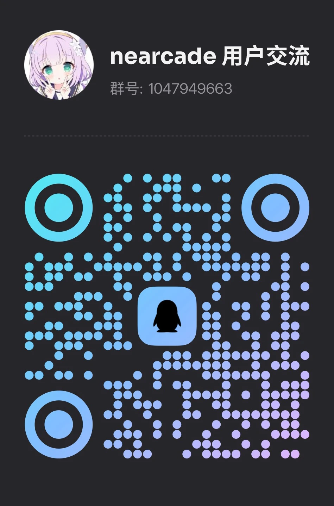
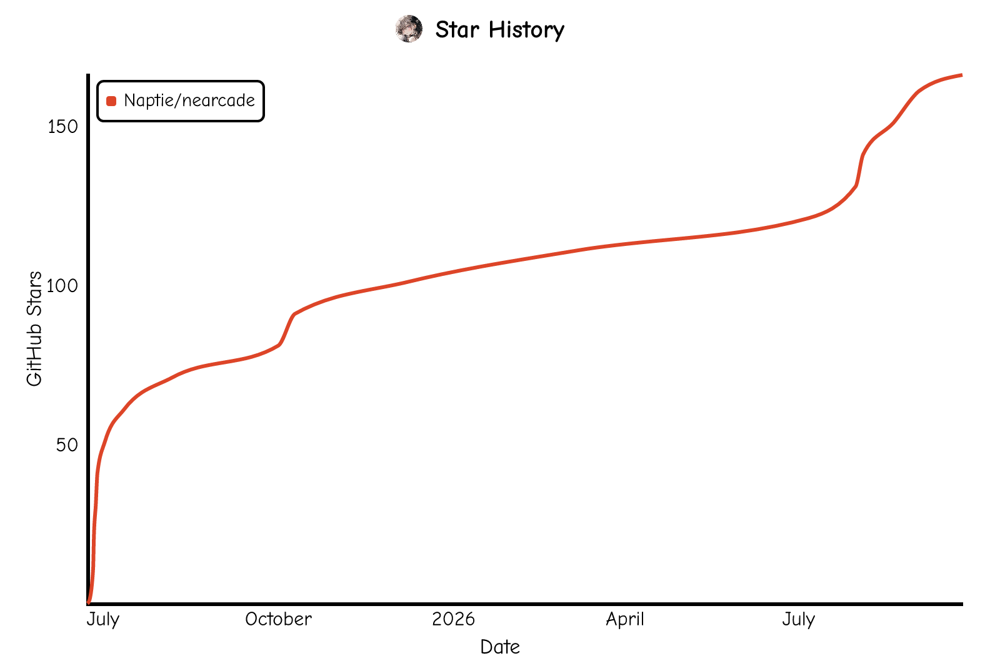

**中文** | [English](README_en.md)

一个帮助玩家寻找机厅并与社群建立联系的网站。在这里，不仅可以找到距您最近的机厅，还可以加入高校社团、参与社区讨论。

有关网站的问题答疑、数据纠正、功能建议等请加入 QQ 群进行交流。



## ✨ 功能特性

### 🎯 基于位置的发现

- **我的位置**: 使用 GPS 查找您当前位置附近的机厅。
- **高校搜索**: 搜索特定高校和校区附近的机厅。
- **地图选点**: 在交互式地图上选择任意位置。
- **自定义半径**: 在 1 至 30 公里的半径内进行搜索。

### 🏆 校园排行

- 按街机密度和机台可用性对高校进行排名。
- 指标包括店铺数量、总机台数和区域密度。
- 提供流行游戏的专项排名。
- 数据每日更新，并有 24 小时缓存刷新机制。

### 💬 社区与社交

- **用户账户**: 支持使用 QQ、Phira、osu!、GitHub、Discord 或微软账户注册。
- **用户资料**: 公开的个人主页，包含动态、隐私设置等。
- **高校社团**: 创建和加入高校社团，参与社团内部的讨论。
- **社区帖子**: 在支持 Markdown 与 LaTeX 的论坛中分享动态、提出问题和评论。
- **通知系统**: 获取关于新评论、回复和社团活动的通知。

### 🎮 支持的游戏

- 舞萌 DX
- 舞萌
- 中二节奏
- 音律炫动
- beatmania IIDX
- jubeat (国际版)
- Nostalgia
- GuitarFreaks
- DrumMania
- DANCERUSH STARDOM
- Dance Dance Revolution
- pop'n music
- DanceEvolution
- REFLEC BEAT
- 太鼓之达人 (旧代)
- 音炫轨道
- 华卡音舞
- 泵动巅峰
- 星光
- DJMAX Technika
- 鼓王
- 舞力特区
- 初音未来 歌姬计划 Arcade
- 音击
- DANCE aROUND
- 太鼓之达人
- 舞立方EVO
- jubeat音乐魔方

### 🗃️ 数据采集

机厅数据原则上由社区维护，而由于网站在早期版本中未实现信息维护系统，因此主要从第三方采集机厅数据。出于向公众告知的考量，在此公示早期版本网站主要依赖的数据源。

- 国内机厅数据（内地、港澳台）采集自 [BEMANICN 全国音游地图](https://map.bemanicn.com/)。海外机厅数据采集自 [Zenius -I- vanisher.com](https://zenius-i-vanisher.com/v5.2/arcades.php)。
- 内地高校列表来自[教育部](http://www.moe.gov.cn/jyb_xxgk/s5743/s5744/A03/202506/t20250627_1195683.html)；校区地理信息使用 [Naptie/cn-university-geocoder](https://github.com/Naptie/cn-university-geocoder) 采集自[腾讯地图](https://lbs.qq.com/)。

## 🛠️ 技术栈

### 前端框架

- **SvelteKit**: 全栈框架，支持 SSR/SPA。
- **Svelte 5**: 最新版本，拥有增强的响应式系统。
- **TypeScript**: 全程提供类型安全。

### 样式与界面

- **Tailwind CSS 4.0**: 工具优先的 CSS 框架。
- **daisyUI**: 用于 Tailwind 的语义化组件库。
- **Font Awesome**: 全面的图标库。

### 后端与数据库

- **MongoDB**: 应用主数据库。
- **Better Auth**: 处理用户认证、会话以及邮箱验证。
- **服务端 API**: 基于 SvelteKit 构建的 RESTful 端点。

### 地图与定位服务

- **高德地图 & 腾讯地图**: 地图服务集成。
- **Geolocation API**: 基于浏览器的定位检测。

### 国际化

- **Paraglide.js**: 类型安全的 i18n 解决方案。
- **基于消息的翻译**: 结构化的翻译体系。

### 开发工具

- **Vite**: 高性能的构建工具和开发服务器。
- **ESLint**: Svelte 特定的代码检查规则。
- **Prettier**: 支持插件的代码格式化工具。
- **pnpm**: 快速、高效的包管理器。

## 🚀 开始使用

nearcade 的本地开发环境完全基于 Docker Compose：应用本身与 MongoDB、Redis、
Meilisearch、MinIO 都在容器中运行，应用容器只通过内部 Compose 网络访问这些服务
（如 `mongo`、`redis`），**仅应用自身的开发服务器端口会暴露到宿主机**。

### 环境要求

- **Docker** 与 **Docker Compose**（唯一必需项——应用本身也在容器中运行）
- Node.js 18+ 与 pnpm（可选，仅用于在宿主机上直接运行 `pnpm dev:setup`/`pnpm seed:*`
  等辅助脚本；也可以不安装，直接运行 `bash scripts/dev-setup.sh`）

### 一键启动（推荐）

```bash
git clone https://github.com/Naptie/nearcade.git
cd nearcade

# 启动应用与全部本地服务，并自动生成 .env
pnpm dev:setup
# 或不依赖 Node/pnpm：bash scripts/dev-setup.sh

# 可选：恢复脱敏的种子数据（店铺、高校、地区等公开数据）
pnpm dev:setup --seed
```

启动完成后访问 `http://localhost:5173` 即可——无需在宿主机运行 `pnpm install`
或 `pnpm dev`，应用容器已自动完成安装并启动开发服务器（支持热更新，本地源码通过
bind mount 挂载到容器内）。

`pnpm dev:setup` 会：

1.  基于 `.env.example` 生成本地 `.env`，自动填入**随机生成的 `SSC_SECRET` 与
    `AUTH_SECRET`**，并根据 MinIO 配置**自动计算 `OSS_S3_BASE64`**；
2.  通过 `docker compose up -d --build --wait` 启动 **应用本身、MongoDB、Redis、
    Meilisearch、MinIO**（含自动建桶），并等待应用容器就绪。

> 已有 `.env` 中的值会被保留，仅填充缺失项与占位符。需要地图、Firebase 推送、SMTP 等功能时，按需在 `.env` 中填入真实密钥即可。

### 种子数据

公开数据（`regions`、`counters`、`universities`、`shops`）可以从开发数据库导出为脱敏种子数据，再恢复到本地 MongoDB：

```bash
# 从某个开发数据库导出（在宿主机运行，该地址是外部数据源，与本地 Compose 网络无关）
# 通过 SEED_SOURCE 环境变量或 --source 参数指定数据源
SEED_SOURCE=mongodb://host:27017/?dbName=nearcade pnpm seed:dump
# 或
pnpm seed:dump -- --source mongodb://host:27017/?dbName=nearcade

# 恢复到本地 MongoDB / 清空本地种子集合
# 必须在应用容器内执行，因为本地 MongoDB 默认不对宿主机暴露端口：
docker compose exec app pnpm seed:restore
docker compose exec app pnpm seed:clear
```

`pnpm dev:setup --seed` 已自动完成 `docker compose exec app pnpm seed:restore` 这一步。

`seed:dump` 的脱敏处理非常克制，仅剔除以下字段：

- **图片引用**：`universities.avatarUrl`、`universities.avatarImageId`（指向本地不可用的 OSS）；
- **所有权/环境相关字段**：`shops.isClaimed`（关联本地不存在的用户账号）；
- 各集合的 `_id`（由 MongoDB 在插入时重新生成）。

`createdAt`/`updatedAt` 等时间戳会**原样保留**；`counters.seq`（下一个店铺 ID）也会**原样保留**，确保新建店铺的 ID 不会与种子数据冲突。

种子文件输出到 `data/seed/`（已被 gitignore，不提交到仓库）。

### 手动配置环境变量（可选）

如果不想使用 `pnpm dev:setup`，可参考 `.env.example` 手动创建 `.env`。核心配置如下：

```env
# 数据库——应用容器通过内部 Compose 网络访问，使用服务名而非 localhost
MONGODB_URI="mongodb://mongo:27017/?dbName=nearcade"

# 服务器间通讯密钥 (生成一个随机字符串)
SSC_SECRET="your_ssc_secret"

# Auth 密钥 (生成一个随机字符串)
AUTH_SECRET="your_random_auth_secret"

# Redis
REDIS_URI = "redis://redis:6379"

# Meilisearch
MEILISEARCH_HOST = "http://meilisearch:7700"
MEILISEARCH_API_KEY = "dev-master-key"
```

> MongoDB、Redis、Meilisearch、MinIO 默认**不会**对宿主机暴露端口——应用容器与它们
> 同属一个 Compose 网络，通过服务名互相访问，与宿主机上是否已安装同名服务完全无关。
> 如需在宿主机用 mongosh / RedisInsight / MinIO 控制台等工具直接查看数据，取消
> `docker-compose.yml` 中对应服务 `ports:` 段落的注释后重新 `docker compose up -d` 即可。

**OAuth 提供商（GitHub 必填，其余可选）:**

```env
# GitHub
AUTH_GITHUB_ID="your_github_oauth_id"
AUTH_GITHUB_SECRET="your_github_oauth_secret"

# 可选：Microsoft / Discord / osu! / Phira / QQ
# AUTH_MICROSOFT_ENTRA_ID_ID = "..."
# AUTH_MICROSOFT_ENTRA_ID_SECRET = "..."
# AUTH_MICROSOFT_ENTRA_ID_ISSUER = "..."
# AUTH_DISCORD_ID = "..."
# AUTH_DISCORD_SECRET = "..."
# AUTH_OSU_ID = "..."
# AUTH_OSU_SECRET = "..."
# AUTH_PHIRA_ID = "..."
# AUTH_PHIRA_SECRET = "..."
# AUTH_QQ_ID = "..."
# AUTH_QQ_SECRET = "..."
```

未配置的 OAuth 提供商不会注册，登录界面不会出现对应按钮，也不会影响启动。

**SMTP 配置（可选，用于邮箱地址与在校生资格验证邮件）:**

```env
SMTP_HOST = "smtp.example.com"
SMTP_PORT = "587"
SMTP_USER = "your_smtp_user@example.com"
SMTP_PASSWORD = "your_smtp_password"
SMTP_SECURE = "false" # 465 端口通常为 true，587 端口通常为 false
SMTP_FROM = "nearcade <no-reply@example.com>" # 可选，默认使用 SMTP_USER
```

**OSS 配置（可选，MinIO 本地已自动配置）:**

```env
# LeanCloud 与 S3 二选一，二者均提供时优先选择 S3

# LeanCloud 配置
OSS_LEANCLOUD_APP_ID = "your_leancloud_app_id"
OSS_LEANCLOUD_APP_KEY = "your_leancloud_app_key"
OSS_LEANCLOUD_SERVER_URL = "https://oss.example.com"

# S3 配置 JSON (使用 Base64 编码)
# 示例（本地 Docker 环境使用内部服务名 minio）:
# {
#   "endpoint": "http://minio:9000",
#   "region": "us-east-1",
#   "bucket": "nearcade",
#   "accessKeyId": "minioadmin",
#   "secretAccessKey": "minioadmin",
#   "bucketEndpoint": false,
#   "forcePathStyle": true
# }
OSS_S3_BASE64 = "your_base64_content"
```

**Firebase Cloud Messaging 配置（可选）:**

```env
# Google 服务账号 JSON (使用 Base64 编码)
GSAK_BASE64="your_base64_content"

# Firebase Cloud Messaging 代理
FCM_PROXY="https://example.com/api/notifications/fcm/send"
```

其中，有关 Firebase Cloud Messaging 代理，请参考[该终结点](src/routes/api/notifications/fcm/send/+server.ts)。

完成 `.env` 配置后，运行 `docker compose up -d --build --wait`，然后访问
`http://localhost:5173`。

### 构建生产版本

```bash
# 构建 Web 应用
pnpm build

# 预览生产版本
pnpm preview
```

## 🐳 Docker 常用操作

- **查看应用日志（含热更新输出）：** `docker compose logs -f app`
- **依赖变更后重新安装：** 应用容器每次启动都会执行 `pnpm install`，重启容器
  （`docker compose restart app`）即可同步新依赖；修改了 `Dockerfile` 本身则需要
  `docker compose up -d --build app`。
- **进入应用容器执行任意命令：** `docker compose exec app <command>`（如
  `pnpm check`、`pnpm seed:restore`）。
- **停止容器：** `docker compose down`
- **停止容器并删除数据卷（将清空本地数据）：** `docker compose down -v`

## 🤝 参与贡献

我们欢迎各种形式的贡献！欢迎提交 issues 和 pull requests。

### 开发准则

- 遵循 TypeScript 最佳实践。
- 使用 Prettier 进行代码格式化。
- 编写有意义的提交信息。
- 充分测试您的更改。

## ⭐ 星标历史

<picture>
  <source media="(prefers-color-scheme: dark)" srcset="static/star-history/star-history-dark.svg">
  <source media="(prefers-color-scheme: light)" srcset="static/star-history/star-history-light.svg">
  
</picture>

## 📄 开源许可

本项目基于 [Mozilla Public License 2.0](LICENSE) 开源。
